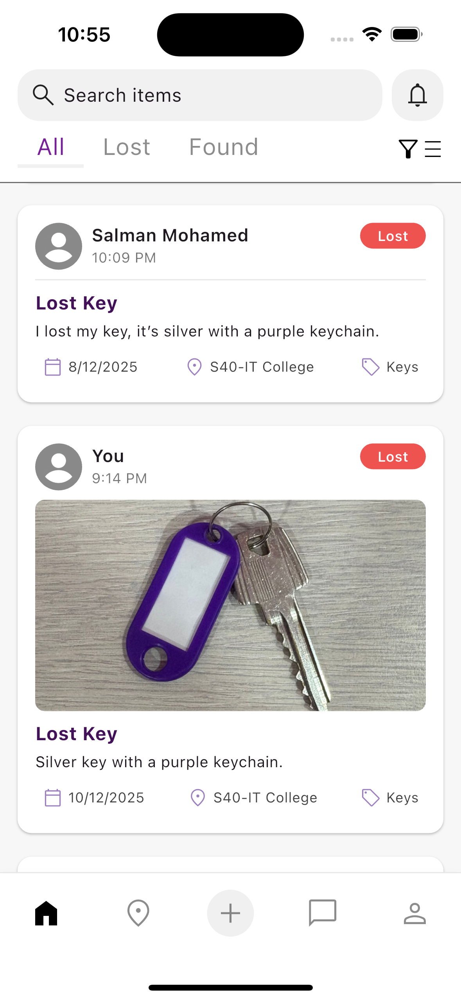
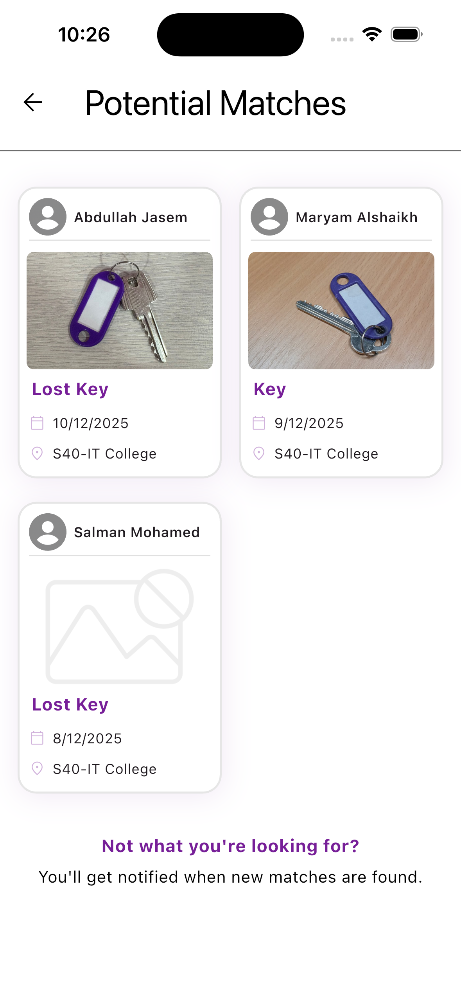

# UniFind – AI-Powered Campus Lost & Found System

## 🚀 Overview

UniFind is a smart mobile application developed to modernize the lost and found process at the University of Bahrain. Traditional manual reporting methods are slow, disorganized, and inefficient. UniFind solves this problem by providing an AI-powered matching system that intelligently connects lost and found items.

The system combines a Flutter mobile application, Firebase cloud services, and a Python Flask AI server integrated with CLIP for multimodal matching. The matching engine analyzes both item images and textual descriptions, allowing accurate matching even when only text is provided, and combining both modalities when available.

---

## 🎯 Problem Statement

On-campus lost and found processes are typically manual and time-consuming. Students rely on security offices or informal communication channels, which can delay item recovery.

UniFind streamlines this process by:
- Digitizing lost and found reporting
- Using AI to generate potential matches
- Enabling direct communication between users
- Providing real-time match notifications

---

## ✨ Key Features

### 🔐 Authentication & Profile
- University email registration
- Secure login and logout
- Password reset via email
- Profile update 

### 📦 Item Management
- Report lost or found items with:
  - Title
  - Category
  - Description
  - Location
  - Date
  - Image upload
- View all unclaimed posts
- Search items by keyword
- Filter by category, type, date, and location
- Mark items as claimed
- Archive claimed posts
- Delete personal posts

### 🤖 AI-Powered Matching
- Automatic potential match generation
- Image and metadata comparison using CLIP
- Real-time match notifications
- Match tracking system for reported items

### 💬 Real-Time Chat
- Start chat between item owner and finder
- Send text and image messages
- Unread message indicators
- Message timestamps and read status

### 🔔 Notifications System
- Match notifications
- Unread notification counter
- View matched item details
- Automatic read status update

### 🏢 Security Office Locations
- View official university security office room numbers
- Quick access to drop-off or claim physical items
  
---

## 🏗 System Architecture

UniFind consists of three main components:

1. Flutter Mobile Application (Front-End)
2. Firebase Services (Cloud Backend)
3. Python Flask AI Server (AI Matching Engine)

The AI server processes item images using OpenAI’s CLIP model and generates similarity scores to determine potential matches between lost and found items.

---

## 🛠 Tech Stack

### Mobile Application
- Flutter (Dart)

### Backend & AI
- Python
- Flask
- CLIP (Contrastive Language–Image Pretraining)
- Flask-CORS

### Cloud Services
- Firebase Authentication
- Cloud Firestore (NoSQL database)
- Firebase Storage

---

### 🏠 Home Page

### 🤖 Potential Matches

### 💬 Chat Feature

---

## 🎥 Demo

Watch the project demo here:  
👉 [UniFind Demo Video](https://youtu.be/Daz-H0-bYF0?si=Zssv8fb8SgvhcNaN)

---

## 🌐 Project Website

UniFind has a project website that introduces the system architecture, features, and design process.

🔗 Visit the website here:  
https://www.unifind.site

